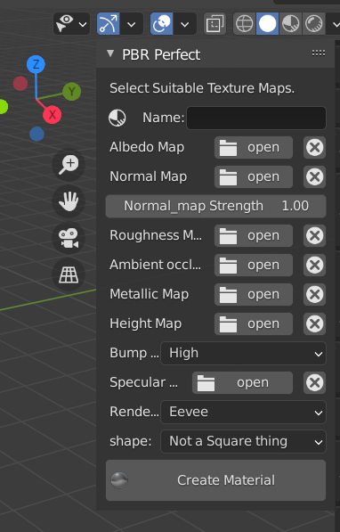
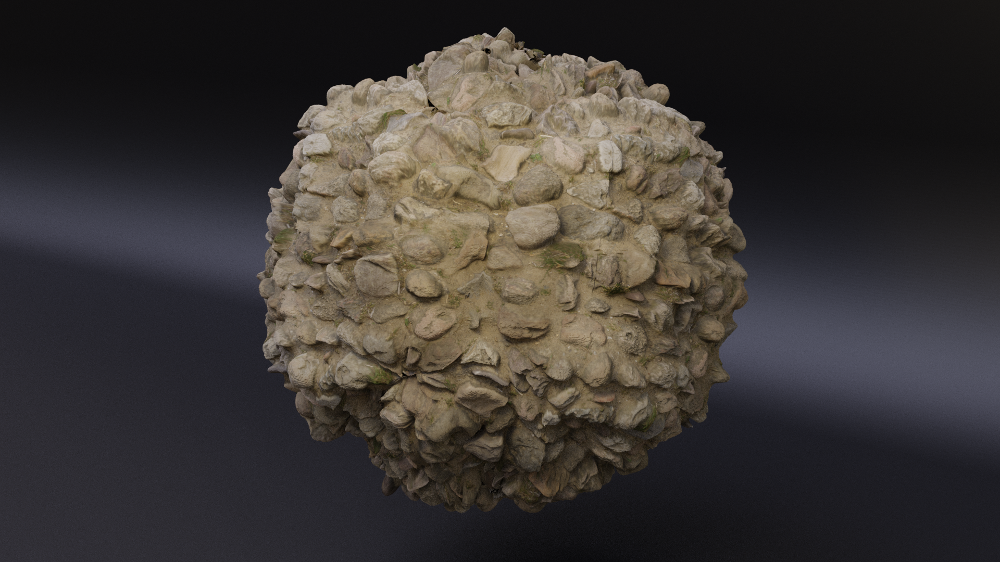
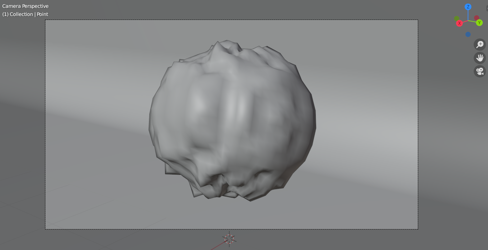

# PBR_Perfect-Add-on   (for blender 2.90.1)
Read wiki to know how to use and To install it do same as any other addon , the zip file is PBR_Perfect.zip 

# UI Of the Panel
 

# Cycles Rendered Image

# Mesh

